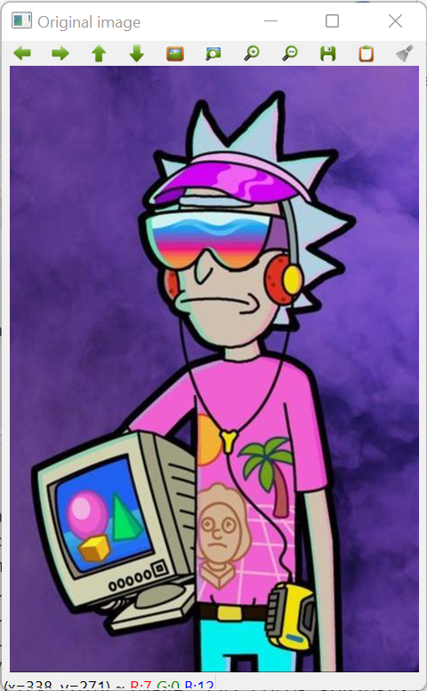

# Color Conversion
## AIM
To perform the color conversion between RGB, BGR, HSV, and YCbCr color models.

## Software Required:
Anaconda - Python 3.7
## Algorithm:
### Step1:
Import cv2 and save and image as filename.jpg

### Step2:
Use imread(filename, flags) to read the file

### Step3:
Use cv2.cvtColor(src, code, dst, dstCn) to convert an image from one color space to another.

### Step4:
Split and merge the image using cv2.split and cv2.merge commands.

### Step5:
End the program and close the output image windows.

## Program:
```python
# Developed By:S.Kishore
# Register Number:212222240050
# ORIGINAL IMAGE
import cv2
rick_color_image = cv2.imread('rick.jpg')
cv2.imshow('Original image', rick_color_image)
cv2.waitKey(0)
cv2. destroyAllWindows()


# i) Convert BGR and RGB to HSV and GRAY
import cv2
rick_color_image = cv2.imread('rick.jpg')
hsv_image = cv2.cvtColor(rick_color_image, cv2.COLOR_BGR2HSV)
cv2.imshow('BGR2HSV' ,hsv_image )
hsv_imagel = cv2.cvtColor(rick_color_image, cv2.COLOR_RGB2HSV)
cv2.imshow('RGB2HSV' , hsv_imagel)
gray_image = cv2.cvtColor(rick_color_image, cv2.COLOR_BGR2GRAY)
cv2.imshow( 'BGR2GRAY', gray_image)
gray_image1 = cv2.cvtColor (rick_color_image, cv2.COLOR_RGB2GRAY)
cv2.imshow('RGB2GRAY', gray_image1)
cv2.waitKey(0)
cv2. destroyAllWindows()


# ii)Convert HSV to RGB and BGR
import cv2
rick_HSV_image = cv2.imread('rick.jpg')
RGB_image = cv2.cvtColor(rick_HSV_image,cv2.COLOR_HSV2RGB)
cv2.imshow('HSV to RGB',RGB_image )
BGR_image = cv2.cvtColor(rick_HSV_image,cv2.COLOR_HSV2BGR)
cv2.imshow('HSV to BGR',BGR_image)
cv2.waitKey(0)
cv2.destroyAllWindows()


# iii)Convert RGB and BGR to YCrCb
import cv2
rick_color_image = cv2.imread('rick.jpg')
YCrCb_image = cv2.cvtColor(rick_color_image, cv2.COLOR_RGB2YCrCb)
cv2.imshow('RGB2YCrCb',YCrCb_image)
YCrCb_image1 = cv2.cvtColor(rick_color_image, cv2.COLOR_BGR2YCrCb)
cv2.imshow('BGR2YCrCb',YCrCb_image1)
cv2.waitKey(0)
cv2.destroyAllWindows()


# iv)Split and Merge RGB Image

import cv2
image = cv2.imread('rick.jpg')
blue=image[:,:,0]
green=image[:,:,1]
red=image[:,:,2]
cv2.imshow('B-Channel',blue)
cv2.imshow('G-Channel',green)
cv2.imshow('R-Channel',red)
merged_BGR=cv2.merge((blue,green,red))
cv2.imshow('Merged BGR Image',merged_BGR)
cv2.waitKey(0)
cv2.destoryAllWindows()


# v) Split and merge HSV Image
import cv2
image=cv2.imread('rick.jpg')
hsv=cv2.cvtColor(image,cv2.COLOR_BGR2HSV)
h,s,v=cv2.split(hsv)
cv2.imshow("Hue-image",h)
cv2.imshow("Saturation-image",s)
cv2.imshow("gray-image",v)
Merged_HSV=cv2.merge((h,s,v))
cv2.imshow('Merged HSV Image',Merged_HSV)
cv2.waitKey(0)
cv2.destoryAllWindows()


```
## Output:
### Original




### i) BGR and RGB to HSV and GRAY


### ii) HSV to RGB and BGR


### iii) RGB and BGR to YCrCb


### iv) Split and merge RGB Image


### v) Split and merge HSV Image


## Result:
Thus the color conversion was performed between RGB, HSV and YCbCr color models.
